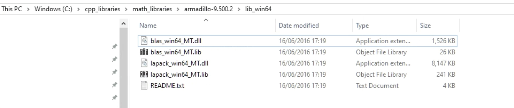
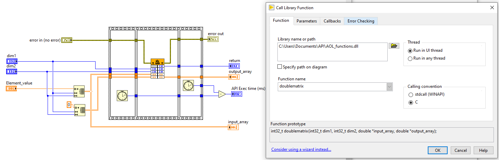
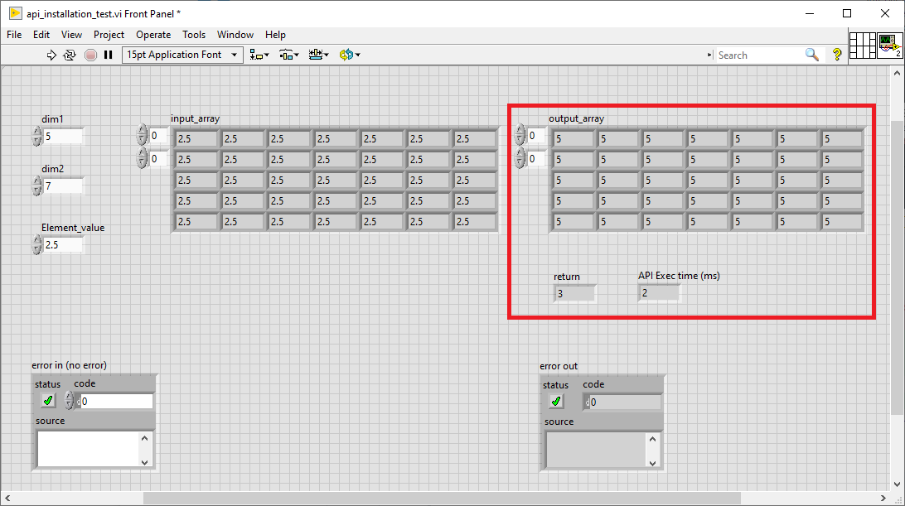

## API Installation Procedure

The provided API is in the form of a windows dynamic link library (dll).
The helper header file listing the functions in the dll is provided (please see the
  'support' folder)

The following software/packages are needed for installing API on your PC.

1. VC++ redistributable x64 located here
[https://support.microsoft.com/en-gb/help/2977003/the-latest-supported-visual-c-downloads]
2. Armadillo package located here - [http://arma.sourceforge.net/download.html]
Please use the version '9.500.2'. This is the only version that is useable.
The BLAS and LAPACK precompiled binaries provided by Armadillo are being used by the DLL.

### Procedure

 - Install the VC++ redistributable.
 - Create the following directory structure -
    *C:\cpp_libraries\math_libraries*
 - Place the unzipped Armadillo folder inside the above directory. The directory
    structure should look like this -
    C:\cpp_libraries\math_libraries\armadillo-9.500.2
 - Go to the *..\armadillo-9.500.2\examples* folder
 - Cut the *lib_win64* and place it directly under the *armadillo-9.500.2* folder.
   The final structure should look like this -
   *C:\cpp_libraries\math_libraries\armadillo-9.500.2\lib_win64*

figure 1. Armadillo library placement - final structure

### Testing the Installation

Download the *api_installation_test.vi* file from the *support* folder.
Open the block diagram and go to the *Call library node* function. Double click on it and
link the *AOL_functions.dll* from your local drive correctly.

figure 2. API function call -  api_installation_test.vi (LabVIEW)

***Note:*** The AOL_functions.dll file can be located anywhere on the PC.
However a shallow directory on the root (C:\) drive is preferable.
If the AOL_functions.h header file is needed, it should be placed next to the AOL_functions.dll file.

The *api_installation_test.vi* simply takes in a sample 2D array and doubles it.
Run the VI and verify that this is happening.
On a successful run, you should see the following -
1. The *output_array* element values should be double the *input_array* element values. This verifies that Armadillo and the underlying BLAS and LAPACK libraries are being called correctly.

2. *return* should be equal to 3. This ensures that the function has run without any internal errors.

3. *API Exec time (ms)* should ideally be less than 5 ms. However, should certainly not be consistently in 10s of ms or more. This will verify that anti-virus or any other internal windows process is not blocking the API.

figure 3. api_installation_test.vi front panel depicting successful installation  

If you see any error popping up or errors appearing in *error out* indicator, note the error code and check on the National Instruments website. Also ensure that the installation process is followed correctly.

<a href="usage.md"> >> API core functions details.</a>
