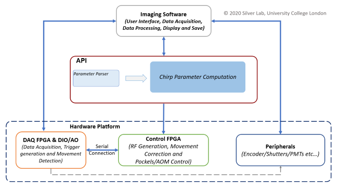
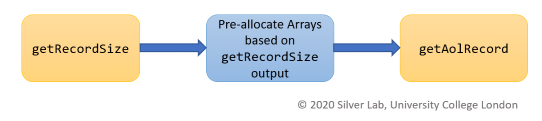

**IMPORTANT NOTE**  
The API has been developed hand in hand with its implementation in our LabVIEW software.
Hence, the examples provided are in LabVIEW. Matlab examples will be provided in the near future.  

The functions prototypes in the API are 'C' compliant. Hence users can use it in any other environment using standard DLL API call methods (however, success is not guaranteed).

### Using the API

The API calculates chirps for a full frame  plane or a set of ROIs based ( a 'record' ).

This chirp computation forms the core of the AOL controller based microscope software. The aim of this API is to enable integration of Silverlab's AOL based microscopy into any compatible 3rd party software.

  
figure 4. API positioning within the microscopy software.


The number of lines is limited to 2048 for each run of the API.

__The API consists of 2 main functions -__

`getRecordSize` : This function calculates array sizes for AOL records.
These size values are then used to pre-allocate arrays for input to the main
AOL chirp record function.

`getAolRecord`  : Computes the AOL chirp record.

The following figure shows the function call sequence logic -
   

figure 5. function call sequence

The details of each function are as follows -

#### getRecordSize

```
int getRecordSize
(
  int no_of_lines,                //input
  double *scanVariables,          //input
  double *start_coordinates,      //input
  int *no_of_rows,	          //output
  int *record_size,               //output
  int *imaging_mode               //output
);
```

`int no_of_lines` : Is equal to the frame size for full frame imaging or equal to   
the cumulative total or all lines for ROI based imaging (32 bit / 4 byte integer).

`double *scanVariables` : 1-D Array (8-byte double) of scanning variables to be obtained from the microscopy software GUI. Described in detail in the following section.

`double *start_coordinates` : 2-D Array (8-byte double) of XYZ start co-ordinates.
X and Y coordinates are normalised. The Z coordinates are in micrometers.
For full frame live imaging, a the 2-D array consists of a single row. In this row, the X and Y co-ordinates are both 0.

`int *no_of_rows` : Reserved, used for debugging.

`int *record_size` : one dimension of the 2-D arrays to be pre-allocated for the main  *getAolRecord* function.

`int *imaging_mode` : Reserved, used for debugging.

#### getAolRecord

```
int getAolRecord
(
	int field_correction_input,            //input
	double *pixels_per_line,               //input
	double *XYZ_start,                     //input
	double *XYZ_stop,                      //input
	double *arrayDims,                     //input
	double *scanVariables,                 //input
	double *AOL_Params,                    //input
	double *Scan_Params,                   //input
	double *drive_param_1,                 //output
	double *drive_param_2,                 //output
	double *drive_param_3,                 //output
	double *drive_param_4,                 //output
	double *drive_param_5,                 //output
	double *field_correction_1,            //output
	double *field_correction_2,            //output
	double *field_correction_3,            //output
	double *field_correction_4,            //output
	double *field_correction_5             //output
);
```

`int field_correction_input` : Flag of whether the chirp calculation is for imaging or field correction
0 = false, 1 = true

`double *pixels_per_line` : This input is reserved for future developments. Hence only send an empty array.

`double *XYZ_start` : 2-D Array (8-byte double) of X, Y and Z start coordinates of all lines.  
X and Y coordinates are normalised. The Z coordinates are in micrometers.
For full frame live imaging, a the 2-D array consists of a single row. In this row, the X and Y co-ordinates are both 0.

`double *XYZ_stop` : 2-D Array (8-byte double) of X, Y and Z stop coordinates of all lines.  
X and Y coordinates are normalised. The Z coordinates are in micrometers.
For full frame live imaging, a the 2-D array consists of a single row. In this row, the X and Y co-ordinates are both 0.

`double *arrayDims` : 1-D Array (8-byte double) of the following -

| Index No.  | Input |
| ------------- | ------------- |
| 0 | length of XYZ_start or XYZ_stop  |
| 1  | 3 (fixed)  |
| 2  | 1 (fixed)  |

`double *scanVariables` :	1-D Array (8-byte double) of the following -
(please take a careful note of the units)

| Index No.  | Input |
| ------------- | ------------- |
| 0 | AOL mode (see sep. table)  |
| 1 | laser wavelength [m]  |
| 2 | Centre frequency [Hz]  |
| 3 | Acceptance angle [rad]  |
| 4 | Frame size / x pixel density  |
| 5 | Dwell time [s]  |
| 6 | True (Reserved)  |
| 7 | No of pixels per line scan  |
| 8 | False (Reserved)  |
| 9 | False (Reserved)  |
| 10 | True (Reserved)  |
| 11 | Zoom  |

***Important Note***  
Users are advised to strictly adhere to the values provided for reserved variables.
Else, the results would be unpredictable.
For 'false', use value 0, for 'true' use value 1.

The AOL modes are as follows

| No.  | AOL Modes |
| ------------- | ------------- |
| 0  | Invalid  |
| 1  | Raster  |
| 2  | Structural  |
| 3  | Pointing  |
| 4  | Line Scan  |


`double *AOL_Params`:  
1-D Array (8-byte double) of the following -

| Index No.  | Input |
| ------------- | ------------- |
| 0 | Calibrated wavelength [m]  |
| 1 | Sum X |
| 2 | Sum Y |
| 3 | Diff X |
| 4 | Diff Y |
| 5 | Distortion correction|
| 6 | Z norm to micron scaling|
| 7 | X norm to micron scaling|
| 8 | 0 (Reserved) |
| 9 | Controller FPGA clock frequency [Hz] |
| 10 | Data time interval [seconds] |
| 11 | Control System T0 [seconds] |
| 12 | Control System Ta [seconds] |
| 13 | DAQ FPGA clock frequency [Hz] |
| 14 | DAQ FPGA samples to wait after trigger [ticks] |
| 15 | DAQ FPGA AOD Fill time [micro-seconds] |
| 16 | DAQ FPGA start up delay [ticks] |

`double *Scan_Params`:  
1-D Array (8-byte double) of the following -

| Index No.  | Input |
| ------------- | ------------- |
| Swap XY on Stage  | false = 0, true = 1  |

`double *drive_param_1,						     
double *drive_param_2,						     
double *drive_param_3,						     
double *drive_param_4,						     
double *drive_param_5,						     
double *field_correction_1,				 
double *field_correction_2,			 
double *field_correction_3` : Preallocate empty arrays of the following size and generate pointers -   
2-D array (8-byte double), size = *record_size* x 4  
(*record_size* is obtained from *getRecordSize*)

`double *field_correction_4`:  
Preallocate empty arrays of the following size and generate pointers -   
1-D array (8-byte double), size = *record_size* x 1

`double *field_correction_5`:
Single value pointer of the type 8-byte double
